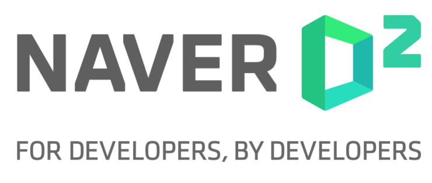

# Who are we?
숭실대학교 소프트웨어학부 해킹&보안 소모임 ASC(Academic Security Club) 입니다. ASC는 해킹 & 보안 관련 대회 참여 및 컨퍼런스 등 정보 공유를 하고 상호간의 발전을 위한 소모임입니다. 자발적으로 공부할 수 있고, 공부에 대한 열정이 넘치는 사람을 찾습니다!

저희는 *시스템해킹(Pwnable)*, *리버싱(Reverse Engineering)*, *웹해킹(Webhacking)*, *암호학(Cryptography)* 등 분야를 가리지 않고 보안 및 해킹에 관심이 있는 숭실대학교 학생을 모집하고 있습니다. 

저희가 하고 있는 활동들은 다양한 국내외 해킹대회(Capture The Flag) 참여, 해킹 스터디(Pwnable, Webhacking, Cryptography) 진행, 해킹대회 문제 제작 및 운영 등을 진행하고 있습니다.

2022-2023 NAVER D2 CAMPUS PARTNER로 활동 및 지원을 받고 있습니다.

#### 2022
- 
[CODEGATE 2022 대학부 2위 (Team 해군해난구조전대)]((https://www.edaily.co.kr/news/read?newsId=03958966632523752&mediaCodeNo=257)
- 
[전국 대학생 사이버보안 경진대회(Hacktheon) 1위 (Team ASC)](https://www.smartcitytoday.co.kr/news/articleView.html?idxno=24207)
- 웹서비스 정보보안 경진대회 대학팀 부문 장려상 (Team 좋은게좋은거지)
- DEFCON CTF FINAL 3위
- 차세대보안리더양성프로그램 Best of the Best 10기 1명 수료
- 차세대보안리더양성프로그램 Best of the Best 11기 1명 진행중
- 소프트웨어마에스트로 SOFTWARE MAESTRO 12기 2명 수료

#### 2021
- Overflow To Fall CTF 2위 (Team ASC)
- corCTF 7위 (Team YASC)
- 차세대보안리더양성프로그램 Best of the Best 9기 1명 수료
- 사이버 보안 챌린지 자동차 해킹대회 본선진출 본선 4위
- 사이버공격방어대회(CCE) 일반부 예선 11위
- DEFCON CTF FINAL 4위
- 
[금융보안 위협분석 대회 대학부 1위, 3위 (Team 파티저스트라잌고양이, KMP)](https://www.boannews.com/media/view.asp?idx=101909)

회장 : 소프트웨어학부 박성준  
부회장 : 컴퓨터학부 채하늘  
총무 : 소프트웨어학부 이광열  

궁금하시면 점이 있으시면 아래 메일로 연락주세요. 😉
